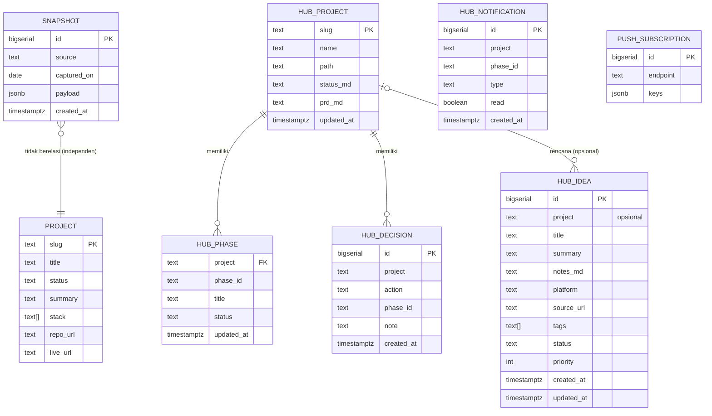

# PRD: Portofolio (Personal Developer Portfolio + Live Dashboard)

**Status**: draft — scaffold dokumentasi selesai; implementasi dimulai pada FASE 1.
**Versi dokumen**: 0.1
**Terkait**: `STATUS.md`, `CHANGELOG.md`, `docs/adr/`

> Dokumen ini menjawab **apa & kenapa**. Progres ada di `STATUS.md`, riwayat rilis di `CHANGELOG.md`, keputusan teknis di `docs/adr/`.

## 1. Ringkasan Produk

Rata-rata portofolio developer hanya memamerkan hasil akhir. Portofolio ini mengambil sudut berbeda: menampilkan **proses dan konsistensi kerja secara real-time** melalui dashboard yang menarik data dari berbagai platform yang sudah dipakai sehari-hari (GitHub, WakaTime, Umami Analytics, MonkeyType). Semua angka berasal dari API asli, bukan klaim manual, sehingga pengunjung melihat profil developer apa adanya.

Selain dashboard, situs ini juga berfungsi sebagai portofolio konvensional: tentang saya, kompetensi, pengalaman, serta daftar proyek yang pernah dan sedang dikerjakan, lengkap dengan tautan live demo yang sudah berjalan di EasyPanel.

Target pengguna: perekrut, klien potensial, dan sesama developer yang ingin menilai kredibilitas dan konsistensi pemilik portofolio.

## 2. Prinsip Desain Utama

- **Transparansi**: semua metrik berasal dari sumber pihak ketiga yang bisa diverifikasi; always tampilkan "terakhir disinkron".
- **Jujur saat gagal**: bila API upstream mati, tampilkan data cache terakhir dengan label _stale_, bukan data palsu — jangan pernah menampilkan angka palsu atau blank.
- **Server-side only**: token API tidak pernah dikirim ke browser.
- **Hemat token & biaya**: cache agresif (ISR + Redis) untuk menekan rate-limit dan jumlah request upstream.
- **Nol kredensial di repo**: semua rahasia lewat environment variable; `.env` di-ignore.
- **Nol memori antar sesi**: `STATUS.md` adalah sumber kebenaran progres.

## 3. Peran Pengguna (Roles)

| Role               | Deskripsi                         | Akses                                    |
| ------------------ | --------------------------------- | ---------------------------------------- |
| Pengunjung (guest) | Perekrut, klien, sesama developer | Semua halaman baca; tanpa login          |
| Pemilik (owner)    | Developer pemilik portofolio      | Menulis konten MDX, mengatur env, deploy |

Pengunjung tidak perlu login. **FASE 3** menambahkan login owner (password + session cookie, ADR-0007) untuk mengakses `/hub`: melihat progres seluruh proyek, mencatat keputusan fase, dan menerima notifikasi penyelesaian fase.

## 4. Fase / Modul Pengembangan

```
FASE 1 → Dashboard live + identitas + halaman proyek (MVP)
FASE 2 → Halaman detail proyek lanjutan + SEO/perf polish + snapshot tren
FASE 3 → Project Hub owner-only: login, progres semua proyek, keputusan fase, notifikasi
FASE 4 → PWA (offline) + inbox ide media + rencana pengembangan per proyek
BACKLOG → Leaderboard publik, blog, multi-bahasa, mode tamu interaktif
```

### 4.1 Hero & Identitas

- Menampilkan nama, role, bio singkat, avatar, tautan sosial dan kontak.
- **Acceptance criteria**: konten berasal dari `content/profile.*` (MDX/config); render tanpa data eksternal; Lighthouse Accessibility >= 90.

### 4.2 Dashboard Live

- Widget: GitHub Contributions, WakaTime, Umami Analytics, MonkeyType, dan status sistem.
- Setiap widget punya state **loading / sukses / error**. Saat upstream gagal → fallback ke snapshot cache + label "stale, last synced ...".
- **Acceptance criteria**: `GET /api/stats/{github|wakatime|umami|monkeytype}` mengembalikan `200` dengan skema JSON tetap meski upstream down; token tidak pernah muncul di bundle client; request upstream <= 1 per TTL (1 jam) — diverifikasi via log.

### 4.3 Tren (Charts)

- Grafik tren metrik lintas waktu, bersumber dari snapshot harian di Postgres.
- **Acceptance criteria**: job snapshot menulis satu baris per sumber per hari; endpoint tren mengembalikan deret waktu untuk rentang yang diminta.

### 4.4 Tentang Saya & Kompetensi

- Bio, kompetensi/skill dengan level, pengalaman/karier (timeline), pendidikan.
- **Acceptance criteria**: konten ter-render dari MDX; struktur dapat diverifikasi manual per file.

### 4.5 Proyek

- `/projects`: daftar proyek dengan filter status `selesai | sedang dikerjakan`.
- `/projects/[slug]`: deskripsi, masalah→solusi, tech stack, gambar, tautan repo, dan **live demo (EasyPanel)**.
- **Acceptance criteria**: setiap proyek punya frontmatter tervalidasi (`title`, `slug`, `status`, `stack`, `liveUrl` opsional); halaman 404 ditangani untuk slug tidak dikenal.

### 4.6 Kesehatan Sistem

- `/api/health` mengembalikan `{ status, version, time }` dengan `200`.

### 4.7 Hub Proyek (owner-only, FASE 3)

- Login owner (`/login`) dengan password + session cookie.
- `/hub`: daftar semua proyek E:\aasatech dengan progres fase; `/hub/[slug]`: detail fase, `STATUS.md`, `PRD.md`, dan riwayat keputusan.
- Proyek melapor lewat `POST /api/hub/ingest` (secret); hub mem-parse fase dari `STATUS.md` dan mendeteksi fase selesai.
- Keputusan "lanjut/tidak" hanya dicatat (tanpa eksekusi kode).
- Notifikasi fase selesai: inbox `/hub/notifications` + Web Push.
- **Acceptance criteria**: ingest menolak tanpa secret (401) & payload tak valid (400); fase yang berubah menjadi selesai membuat satu notifikasi + push; halaman hub menolak akses bukan owner.

### 4.8 PWA (FASE 4)

- Situs dapat dipasang sebagai aplikasi (manifest + ikon 192/512 + maskable), dengan fallback halaman `/offline` saat navigasi tanpa jaringan; aset statis di-cache, request `/api/**` tidak di-cache.
- **Acceptance criteria**: `/manifest.webmanifest` valid & `display: standalone`; service worker terdaftar (produksi); `/offline` tampil saat offline; navigasi normal tetap memuat data segar.

### 4.9 Inbox Ide & Rencana Pengembangan (FASE 4, owner-only)

- `/hub/ideas`: menampung ide baru dari media (Threads/X/TikTok/IG/YouTube/lainnya) — platform dideteksi dari tautan; filter per platform/status/tag; CRUD.
- Tab **"Rencana"** di `/hub/[slug]`: ide pengembangan per proyek (kolom `project` terisi).
- **Acceptance criteria**: API owner-only menolak non-owner (401) & body tak valid (400); satu tabel `hub_idea` dengan `project` opsional melayani inbox umum dan rencana proyek.

## 5. Model Data (ERD)

FASE 1 konten berbasis file (MDX). Postgres dipakai untuk snapshot tren (FASE 2).



Constraint penting: unik `(source, captured_on)` pada `SNAPSHOT`; unik `(project, phase_id)` pada `HUB_PHASE`; unik `endpoint` pada `PUSH_SUBSCRIPTION`.

## 6. Non-Functional Requirements

- **Performa**: target Lighthouse Performance >= 90; data eksternal selalu melalui cache ISR/Redis.
- **Keamanan**: token server-only; secret scan (gitleaks) di CI; OWASP Top 10; rate-limit endpoint publik.
- **Reliabilitas**: degradasi anggun saat upstream down (fallback snapshot); `/api/health` sebagai probe.
- **Aksesibilitas**: WCAG AA, kontras memadai, navigasi keyboard.
- **Observabilitas**: log sinkronisasi + timestamp "last synced" yang tampil di UI.
- **Portabilitas**: 12-Factor (config via env), image Docker `standalone`.

## 7. KPI & Metrik Keberhasilan

| Area         | Metrik                                 | Target                    |
| ------------ | -------------------------------------- | ------------------------- |
| Akurasi data | Widget menampilkan data upstream segar | 100% saat upstream normal |
| Ketahanan    | Widget tetap tampil saat upstream down | 100% fallback cache       |
| Performa     | Lighthouse Performance / Accessibility | >= 90                     |
| Rate-limit   | Request upstream per sumber per hari   | <= 24 (cache 1 jam)       |
| Kualitas     | CI hijau pada `main`                   | 100%                      |
| Konten       | Proyek terdaftar & ter-render          | Semua entri MDX valid     |

## 8. Kepatuhan & Keamanan

- Umum: OWASP Top 10 / ASVS, enkripsi in-transit (HTTPS Let's Encrypt), RBAC tidak diperlukan (read-only publik).
- Privasi: Umami adalah analytics milik pemilik; tampilkan data agregat (tanpa PII pengunjung). Tidak menyimpan cookie tracking tambahan.
- Data residency & rotasi kredensial: token GitHub/WakaTime/Umami dirotasi berkala bila terekspos; tidak disimpan di repo.
- Jangan simpan kredensial di dokumen ini.

## 9. Risiko & Mitigasi

| #   | Risiko                            | Dampak              | Mitigasi                                                               |
| --- | --------------------------------- | ------------------- | ---------------------------------------------------------------------- |
| 1   | Rate-limit / API upstream berubah | Widget gagal        | Cache ISR + Redis, fallback snapshot, adapter per-sumber terisolasi    |
| 2   | Token bocor ke client             | Keamanan            | Server-side only, tidak ada `NEXT_PUBLIC_` untuk token, secret scan CI |
| 3   | Umami self-host tidak tersedia    | Widget kosong       | Fallback snapshot + label stale                                        |
| 4   | Snapshot job gagal                | Tren bolong         | Alert log + backfill dari range API bila tersedia                      |
| 5   | Perubahan skema API pihak ketiga  | Build/runtime error | Test kontrak endpoint, pin versi API bila memungkinkan                 |

## 10. Out of Scope

- Multi-user & komentar (Hub bersifat single-owner, ADR-0007).
- CMS/admin panel (konten berbasis MDX di repo).
- Eksekusi perintah otomatis dari web (keputusan fase hanya dicatat, tidak menjalankan kode).
- Blog dan multi-bahasa (BACKLOG).
- Leaderboard publik real-time (BACKLOG).

## 11. Ringkasan Keputusan

| #   | Pertanyaan                    | Keputusan                                                         |
| --- | ----------------------------- | ----------------------------------------------------------------- |
| 1   | Stack?                        | Next.js App Router + TypeScript + Tailwind + shadcn/ui (ADR-0001) |
| 2   | Cara menarik data eksternal?  | API route server-side + ISR/revalidate + Redis (ADR-0002)         |
| 3   | Deploy di mana?               | EasyPanel via Docker image (ADR-0003)                             |
| 4   | Bagaimana rahasia dikelola?   | Env var server-only, `.env` di-ignore (ADR-0004)                  |
| 5   | Konten proyek & profil?       | MDX in-repo ber-frontmatter (ADR-0005)                            |
| 6   | Sumber grafik tren?           | Snapshot harian Postgres (ADR-0006)                               |
| 7   | Perilaku saat upstream gagal? | Fallback snapshot cache + label "stale"                           |
| 8   | Gaya visual?                  | Ekspresif/animatif, dark/light, aksesibel                         |
| 9   | Autentikasi owner?            | Password + session cookie HMAC (ADR-0007)                         |
| 10  | Sumber progres proyek?        | Push dari proyek ke Postgres via API ingest (ADR-0008)            |
| 11  | Notifikasi fase selesai?      | Web Push + inbox (ADR-0009)                                       |
| 12  | Dukungan PWA?                 | Manifest + service worker dengan fallback offline (ADR-0010)      |
| 13  | Penyimpanan ide & rencana?    | Tabel `hub_idea` (kolom `project` opsional) (ADR-0011)            |
